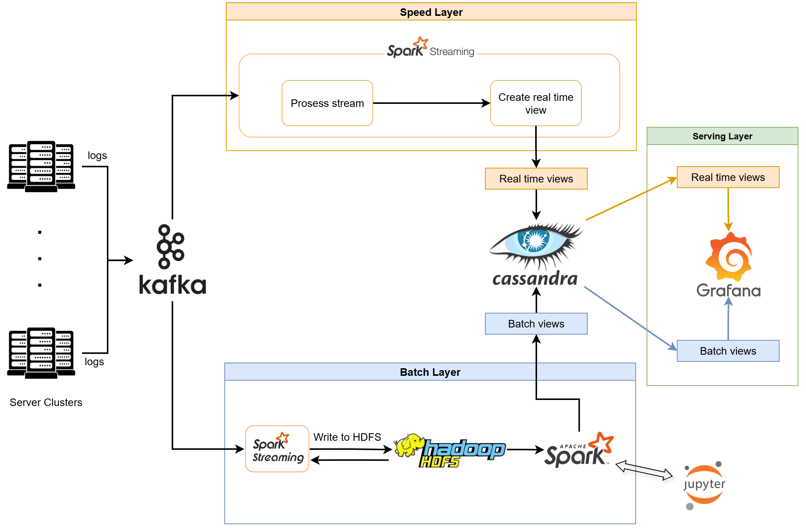

# lambda-architecture

## Requirements

- Docker on your OS
- Optional: Atleast 16GB RAM, but can be set up in lower scale.

## Lambda

#### Start
- Start containers:
```
docker-compose up -d # wait until all container are running completly (around 2 Minutes)
```
- Start jupyter for batch layer processing: Jupyter server run on http://127.0.0.1:9888/lab
```
docker exec -it spark2 bash
export PYTHONPATH=$SPARK_HOME/python:$SPARK_HOME/python/lib/py4j-0.10.9.7-src.zip:$PYTHONPATH
jupyter lab --ip=0.0.0.0 --port=8888 --no-browser --allow-root
```

- Start lambda:
```
python start_lambda.py
```

After all containers are running we need to configure and start few things. 
Within the folder \src we can find few python files. Those files are necessary 
to generate data and tell Kafka, Spark, Hadoop and Cassandra what to do. 


Figure 1: Overview-Architecture


Figure 2: Lambda-Architecture

Whole lambda architecture is created out of few docker containers.

- **Hadoop** as batch-layer with Namenode (http://localhost:9870/)
- **Cassandra** for saving different views
- **Spark1** with workers and master (http://localhost:8080/)
- **Spark2** with workers and master (http://localhost:9080/)
- **Grafana** for visualization (http://localhost:3000/)

Every container is running within same network (**lambda-network**).

## Grafana Setup

To visualize the whole process you can actually use the lambda templates 
for grafana (Grafana_Retailrocket.json)

### Connect to Apache Cassandra

1. Go to http://localhost:3000
2. login (username=admin, password=admin) # can be changed
3. Go to Connections -> Add new connection -> Apache Cassandra -> Install
4. Go to Connections -> Data sources -> Apache Cassandra
5. Fill up following entry -- Host: cassandra1:9042
6. Save & Test

### Dashboard


